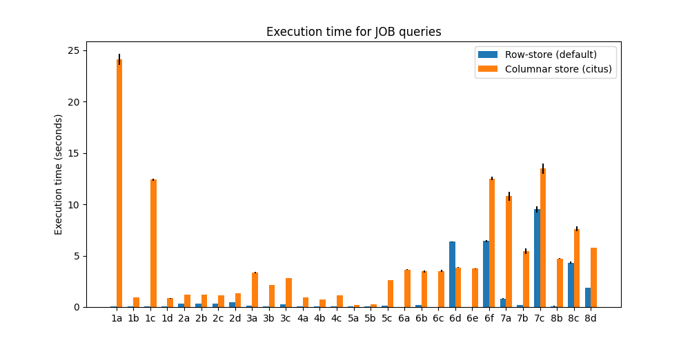

# csep544-project

This repository contains artifacts related to a course project for course 
CSEP544 Database Managment Systems, taken by me at University of Washington in 
Winter 2025.

The project is titled "Experimental comparison of data storage formats". This 
repository contains parts of the project dealing with comparing row and columnar
storage formats in PostgreSQL. We use [citus](https://github.com/citusdata/citus)
to enable columnar store in PostgreSQL.

## Setup

* The setup below is for Ubuntu.
* `sudo apt-get install postgresql postgresql-contrib`
* Install citus following instructions [here](https://github.com/citusdata/citus/tree/main?tab=readme-ov-file#getting-started)
* If getting error "package not found", your Ubuntu is too new, follow instructions [here](https://github.com/citusdata/citus/issues/7692#issuecomment-2406598607).
* `sudo vim /etc/postgresql/16/main/postgresql.conf`, add `shared_preload_libraries = 'citus'`
* `sudo systemctl restart postgresql`
* (optional) To be able to run `psql` as current user:
  * `sudo -i -u postgres`
  * `psql`
  * `CREATE ROLE <user> WITH LOGIN;`
  * `ALTER ROLE <user WITH> SUPERUSER;`
* Set password: `sudo -u postgres psql -c "ALTER USER postgres PASSWORD 'admin';"`

## Hardware

Experiments were run un my laptop:
* Ubuntu 24.04.2 LTS
* CPU: AMD Ryzen™ 7 5825U with Radeon™ Graphics × 16
* RAM: 16.0 GiB

## Methodology

For each workload, we:
* Create 2 databases with similar schemas, only difference being that one of them has `USING columnar` for each table.
* Injest identical data to both databases.
* Compare sizes of tables in bytes.
* Run a set of queries on both databases and compare their execution time ("wall time"). Each query is run 5 times, and we compute mean and standard deviation.

## Experiment 1: TPC-H

* We create two databases using TPC-H schema:
  * Row-store using [this schema](experiments/schema/tpch_postgres.sdl).
  * Columnar using [this schema](experiments/schema/tpch_postgres_columnar.sdl).
* Then we injest data from [this dataset](https://www.kaggle.com/datasets/davidalexander01/tpc-h-dataset).  
* We run queries from TPC-H becnhmark (except 15,17,20,21).
* See details [here](experiments/Experiments%20with%20TPC-H.ipynb).
* Results:
  * Storage: 1.4GB (row) vs. 0.3GB (columnar), 4x compression.
  * Almost all queries (except Q18) got slower by a factor 2x-10x. This was unexpected.

* The same experiment was also repeated on two different machines in the Cloud. This is result for machine OCI: AMD EPYC 7551 (base frequency 2.0 GHz, max boost frequency 3.0 GHz, OCPU: 1 RAM 1 GiB):

* This is result for Azure VM: Standard E2as v5 (vCPUs: 2, RAM: 16 GiB).

* It's interesting that with very limited resources (1GB RAM) columnar is faster that row store (by factor up to 10x for Q14).

## Experiment 1: JOB

* We create two databases using TPC-H schema:
  * Row-store using [this schema](experiments/schema/job_postgres.sql).
  * Columnar using [this schema](experiments/schema/job_postgres_columnar.sql).
* Then we injest data from the classic JOB dataset.
* Then we create indexes.  
* We run queries 1-8 from JOB becnhmark.
* See details [here](experiments/Experiments%20with%20TPC-H.ipynb).
* Results:
  * Storage: 9GB (row) vs. 5GB (columnar), 1.81x compression.
    * Note that archive with data in CSV format is only 1.2GB
  * Almost all queries (except 6d) got much slower, by a factor up to 500x. Again, this was unexpected.

